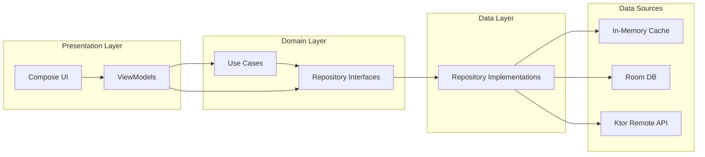
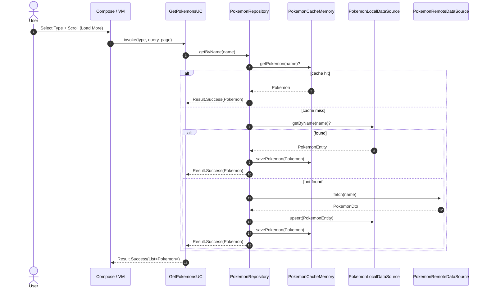
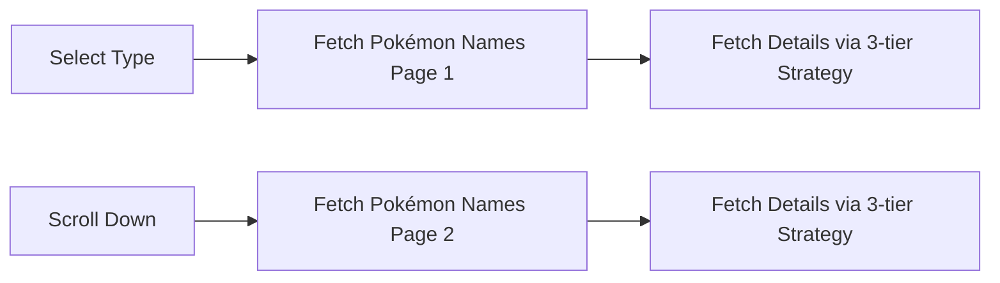
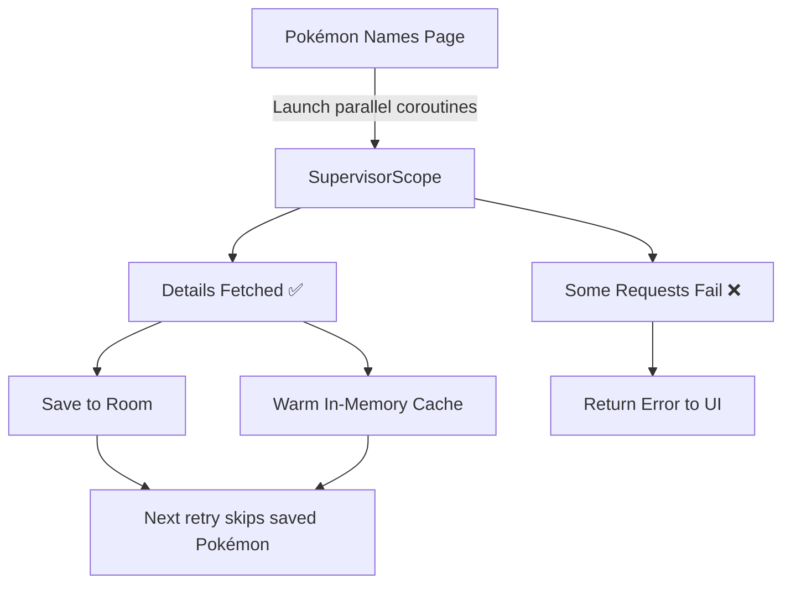
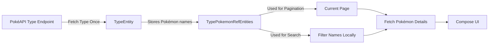
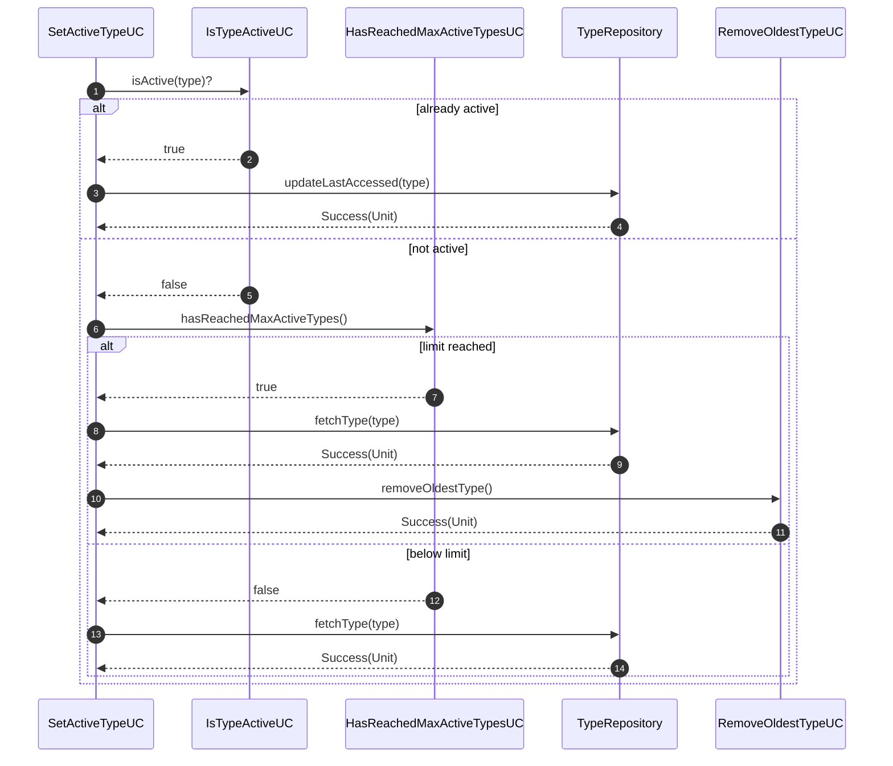

<h1 align="center">Pokémon Explorer</h1>

<p align="center">
  A Pokémon Explorer app built with Kotlin and Jetpack Compose<br>
  Explore, search, and view Pokémon stats with a clean architecture, offline-first strategy, and robust error handling.
</p>

---

## 📦 Libraries & Tools

| Category      | Libraries / Tools |
|--------------|--------------------|
| **Language** | Kotlin 2.2.0 |
| **UI**       | Jetpack Compose, Material 3, Lottie |
| **Networking** | Ktor Client, Kotlinx Serialization |
| **Local Storage** | Room (DB) |
| **DI**       | Koin |
| **Image Loading** | Coil v3 |
| **Logging**  | Kotlin Logging, Logback, SLF4J |
| **Testing**  | JUnit4, MockK, Coroutines Test |

---

## ✨ Features

### Core
- **Type Selection + Search**
  - Browse 10 Pokémon types: Fire, Water, Grass, Electric, Dragon, Psychic, Ghost, Dark, Steel, Fairy.
  - Search Pokémon by name within the selected type.
- **Pokémon List**
  - Shows first 10 Pokémon with option to load more.
  - Inline display of Pokémon stats: name, image, HP, Attack, Defense.
- **Pagination**
  - Efficient paged fetching of Pokémon names & details.

> **Design choice:** Pokémon details are displayed **inline within the list** for faster browsing.  
> A dedicated details screen could easily be added due to the modular design.

### Extras
- **Offline-first** strategy with in-memory cache + Room.
- In-memory cache stores up to **50 Pokémon** for faster repeated access.
- Graceful error handling with consistent mapping of network/local issues to **user-friendly UI states** like snackbars.
- Fast search experience with hot-cache lookups.
- Automatic type lifecycle management: keep a capped number of active types, evict oldest only **after** successfully fetching a new type.
- Fully unit-tested domain layer.

---

# 🧱 Clean Multi-Module Architecture

This project uses **Clean Architecture** principles and a **multi-module Gradle setup**.

```
PokemonExplorer
│
├── presentation    # UI related
├── domain          # Use cases, repositories
├── data            # Local + remote sources, caching (in repository implementation)
├── core            # Shared constants, settings, logging
└── build-logic     # Convention plugins
```

### Module Diagram



---

# 🧠 Data Fetch Strategy (In-Memory → Local → Remote)

We use a **3-tier Single Source of Truth** approach:

1. **In-Memory Cache**  
   Always checked first.
2. **Local DB (Room)**  
   Offline-ready fallback + warms memory cache.
3. **Remote (Ktor)**  
   Fetch from PokéAPI, persist results to DB, update in-memory cache.

### App Constants

| Constant                        | Value | Purpose                               |
|--------------------------------|-------|---------------------------------------|
| `NUMBER_OF_ACTIVE_TYPES`       | `2`   | Max cached Pokémon types             |
| `POKEMON_LIST_PAGE_SIZE`       | `10`  | Number of Pokémon fetched per page   |
| `MAX_CACHED_POKEMON_ENTRIES`   | `50`  | Max Pokémon kept hot in memory       |

### Sequence Diagram



---

# 🔁 Pagination & Search

- Pokémon names are fetched per type in **pages of 10**.
- Each Pokémon name is resolved individually via the **in-memory → local → remote** pipeline.
- Uses **structured concurrency** to parallelise detail fetches safely.



> **Note:** Each Pokémon name uses the same **3-tier strategy** to resolve its details.

---
# 🕸 Structured Concurrency for Pokémon Details

When fetching Pokémon **details** for a page of names, we use **structured concurrency** to fetch them **in parallel**.

- Each Pokémon detail request runs in its own **child coroutine**.
- If **one request fails**, it **does not cancel the others** thanks to `SupervisorScope`.
- Successfully fetched Pokémon:
  - Are **saved to the DB** immediately.
  - Are **added to in-memory cache**.
- If **any request fails**:
  - We **still return an error** to the UI.
  - But successful results remain stored locally, so they **don’t need to be re-fetched** later.

This ensures:
- **Fault tolerance** → failures don’t waste successful work.
- **Optimised caching** → saved results are reused on retry.
- **Accurate UI state** → the UI gets an error unless *all* requests succeed.

### Diagram



---

# ⚡ Type & Pokémon Ref Optimisation

When fetching a Pokémon **type**, the PokéAPI returns **all Pokémon names** for that type in one response.

### How we optimise:
- We store those names locally in the DB as `TypePokemonRefEntities`.
- For pagination and search:
  - We **never re-fetch** the list of names from the API.
  - Instead, we **read cached refs** from the DB.
  - We get the names of the requested pagination.
  - We fetch the **Pokémon details**, for the requested pagination.
- Searching is **instant** because we filter names locally before requesting any details.

### Diagram



---

# 🧹 Type Lifecycle & Eviction

We maintain a **capped number of active types** defined by `AppConstantSettings.NUMBER_OF_ACTIVE_TYPES`.

- If user activates a new type and limit is reached:
  - **First fetch** the new type.
  - **Only on success** remove the oldest cached type.



---

# 🧰 Error Handling Model

All failures are explicitly modelled via a custom `Result` sealed class and mapped to **user-friendly UI states**, such as showing snackbars on errors.

```kotlin
sealed class Result<out T> {
    data class Success<T>(val data: T) : Result<T>()
    sealed class Error : Result<Nothing>() {
        sealed class Remote : Error() {
            data object NotFound : Remote()
            data object Unavailable : Remote()
        }
        sealed class Local : Error() {
            data object CouldNotLoad : Local()
            data object CouldNotSave : Local()
        }
        data class UnknownError(val reason: String) : Error()
        data object Unknown : Error()
    }
}
```

### Wrappers
- safeCallRemote { } → maps network errors
- safeReadLocal { } → maps DB read failures
- safeWriteLocal { } → maps DB write failures

---

## 🧪 Testing

- **Unit tests** for Usecases:
  - Pokémon fetching
  - Type lifecycle logic
- **Tools**: JUnit4, MockK, kotlinx-coroutines-test
